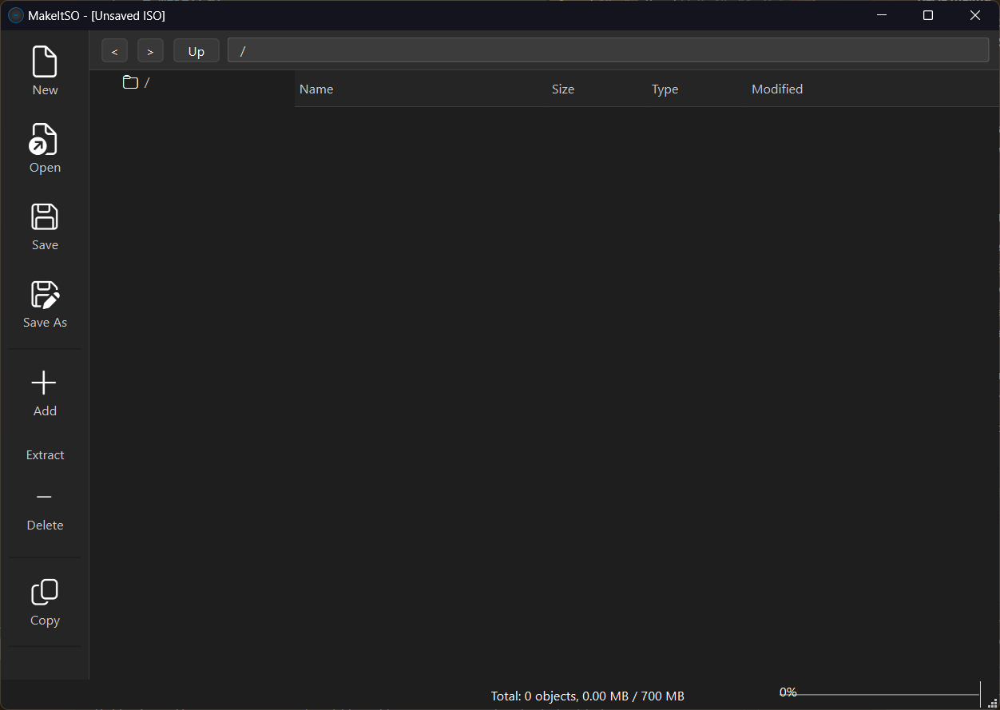

# MakeItSO

MakeItSO is a professional ISO editor built using PySide6 and pycdlib. It provides a modern interface for creating, modifying, and extracting ISO images with support for multiple file system namespaces.




## Features

- Full support for ISO9660, Joliet, and Rock Ridge namespaces.
- Directory tree navigation with browser-like history (Back/Forward/Up).
- "Folders first" sorting and multi-column file list.
- Extraction with real-time progress feedback.
- Clipboard integration: Copy files from an ISO and paste them directly into File Explorer.
- Dynamic storage usage tracking (CD/DVD/Blu-ray tiers).
- Premium dark theme with customizable QSS.

## Requirements

- Python 3.10+
- PySide6
- pycdlib

## Usage

Run the application:
```powershell
python main.py
```